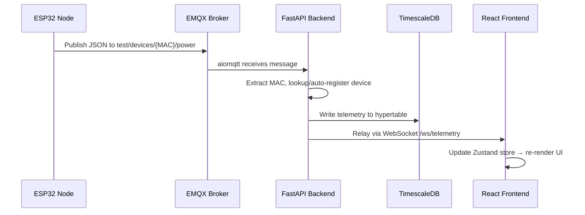

# IoT Architecture: Remote Monitoring Dashboard 

## 1. System Overview

This project is an end-to-end IoT monitoring and management platform, designed for remotely tracking ESP32-based sensor nodes over 4G LTE MQTT. It scales from 1 prototype to 25+ nodes, using a Device-Centric MQTT architecture, dynamic asset mapping, and a real-time responsive dashboard.

The system consists of:

- **Edge devices** (ESP32 + SIM7670) publishing sensor telemetry over MQTT via cellular
- **EMQX Cloud** as the MQTT broker with TLS
- **FastAPI backend** ingesting MQTT streams, storing data, and serving REST/WebSocket APIs
- **React frontend** rendering a real-time multi-device dashboard

---

## 2. Technology Stack

| Layer | Technology | Purpose |
| --- | --- | --- |
| **Hardware / Edge** | ESP32-S3 + SIM7670 (C++) | Reads battery voltage, AC mains status; publishes via 4G LTE MQTT |
| **Message Broker** | EMQX Cloud | High-performance MQTT broker with TLS/SSL |
| **Backend Framework** | Python FastAPI + Uvicorn | Async REST API, WebSocket server, MQTT ingestion |
| **MQTT Client (Backend)** | aiomqtt | Async MQTT subscriber integrated with FastAPI's event loop |
| **ORM** | SQLAlchemy (async) + asyncpg | Async database access with Pydantic model integration |
| **Relational DB** | PostgreSQL | Device registry, users, alert rules, configuration |
| **Time-Series DB** | TimescaleDB (PostgreSQL extension) | Hypertable storage for high-volume telemetry data |
| **Schema Migrations** | Alembic | Database schema versioning and migrations |
| **Authentication** | JWT (PyJWT + passlib + bcrypt) | Token-based authentication and session management |
| **Frontend Framework** | React + Vite | Fast SPA with hot module reload |
| **Charting Engine** | Apache ECharts | Hardware-accelerated time-series rendering |
| **State Management** | Zustand | Lightweight global state for high-frequency live data |
| **Deployment** | Docker & Docker Compose | Containerized full stack for local dev and production |

---

## 3. Monorepo Directory Structure

```text
IoT-Remote-Monitoring-Dashboard/
├── .gitignore
├── .env.example
├── README.md
├── docker-compose.yml              # Master orchestration for the entire stack
│
├── /firmware                        # ESP32 C++ code
│   ├── platformio.ini               # Board and library configurations
│   └── /src
│       └── main.cpp                 # Entry point — reads sensors, publishes MQTT
│
├── /backend                         # Python FastAPI service
│   ├── pyproject.toml
│   ├── requirements.txt
│   ├── Dockerfile
│   ├── alembic.ini
│   ├── /alembic
│   │   └── /versions               # Migration scripts
│   ├── /app
│   │   ├── __init__.py
│   │   ├── main.py                  # FastAPI app entrypoint + lifespan events
│   │   ├── config.py                # Settings via Pydantic BaseSettings (.env)
│   │   ├── database.py              # SQLAlchemy async engine & session factory
│   │   ├── /models                  # SQLAlchemy ORM models
│   │   │   ├── device.py            # Device registry model
│   │   │   ├── telemetry.py         # Telemetry hypertable model
│   │   │   └── user.py              # User model for auth
│   │   ├── /schemas                 # Pydantic request/response schemas
│   │   │   ├── device.py
│   │   │   ├── telemetry.py
│   │   │   └── user.py
│   │   ├── /routers                 # API route handlers
│   │   │   ├── devices.py           # CRUD for device management
│   │   │   ├── telemetry.py         # Historical telemetry queries
│   │   │   ├── auth.py              # Login, register, token refresh
│   │   │   └── websocket.py         # Real-time telemetry relay
│   │   ├── /services                # Business logic layer
│   │   │   ├── mqtt_service.py      # aiomqtt background subscriber
│   │   │   ├── alert_service.py     # Threshold checks & alert generation
│   │   │   └── auth_service.py      # JWT creation, verification, password hashing
│   │   └── /utils
│   │       └── security.py          # JWT helpers, password utilities
│   └── /tests
│       ├── test_devices.py
│       └── test_telemetry.py
│
├── /frontend                        # React + Vite dashboard
│   ├── package.json
│   ├── vite.config.js
│   ├── Dockerfile
│   ├── index.html
│   ├── /public
│   └── /src
│       ├── main.jsx
│       ├── App.jsx
│       ├── index.css                # Design system & global styles
│       ├── /components
│       │   ├── /layout              # Sidebar, Header, AppShell
│       │   ├── /dashboard           # DeviceGrid, DeviceCard, StatusBadge
│       │   ├── /device              # DeviceDetail, TelemetryChart, ChargeDonut
│       │   ├── /auth                # LoginForm, ProtectedRoute
│       │   └── /alerts              # AlertPanel, AlertBell, ToastNotification
│       ├── /store
│       │   ├── useDeviceStore.js    # Zustand — device & telemetry state
│       │   └── useAuthStore.js      # Zustand — auth state
│       ├── /hooks
│       │   └── useWebSocket.js      # WebSocket connection & reconnection hook
│       ├── /services
│       │   └── api.js               # Axios/fetch wrappers for REST API
│       └── /pages
│           ├── Dashboard.jsx        # Main overview with device grid
│           ├── DeviceDetail.jsx     # Detail view with charts
│           └── Login.jsx            # Authentication page
│
├── /infrastructure
│   ├── /database
│   │   └── init.sql                 # Schema initialization (tables + hypertable)
│   └── /emqx
│       └── acl.conf                 # Broker ACL rules
│
└── /docs
    ├── /prototype                   # Archived original test dashboard
    │   └── new-dashboard.html
    └── architecture.md              # Architecture documentation
```

---

## 4. MQTT Topic Architecture & Data Flow

This project uses a **Device-Centric** topic structure to decouple physical hardware from physical locations, making hardware replacements seamless.

**Topic Standard:** `test/devices/{MAC_ADDRESS}/power`\
**Example:** `test/devices/84F3EBB3A12C/power`

### The Ingestion Pipeline:



1. **Publish:** ESP32 reads its own MAC address on boot and publishes a JSON payload to its unique topic.
2. **Subscribe:** The FastAPI backend runs an `aiomqtt` background task subscribing to `test/devices/+/power` (wildcard).
3. **Lookup:** Backend extracts the MAC from the topic string and queries PostgreSQL to find or auto-register the device.
4. **Storage:** Backend writes the telemetry record to the TimescaleDB hypertable with timestamp and device_id.
5. **Relay:** Backend broadcasts the data to all connected frontend clients via WebSocket.

### JSON Payload Format (from ESP32):

```json
{
  "battery_1_voltage": 12.45,
  "battery_2_voltage": 11.98,
  "ac_1_status": "ON",
  "ac_2_status": "OFF"
}
```

---

## 5. Firmware Guidelines

The ESP32 firmware should remain agnostic to its physical location. All hardware nodes run the exact same compiled binary — identity is derived from the MAC address at runtime.

**Current implementation:** \[SIM7670_EMQX_MQTT_Working.ino\](file:///c:/Users/sumit/Desktop/INSYS/IoT-Remote-Monitoring-Dashboard/SIM7670_EMQX_MQTT_Working.ino)

- **Connectivity:** SIM7670 4G LTE modem with native AT-command MQTT over TLS
- **Sensors:** 2× battery voltage (ADC), 2× AC mains detection (HW-122 modules)
- **Publish interval:** Every 1 second
- **MQTT topic:** `test/devices/{MAC_ADDRESS}/power`
- **Broker:** EMQX Cloud (TLS on port 8883)

---

## 6. Backend API Design (FastAPI)

### REST Endpoints

| Method | Endpoint | Description |
| --- | --- | --- |
| `POST` | `/api/auth/login` | Authenticate user, return JWT |
| `POST` | `/api/auth/register` | Register new user (admin only) |
| `GET` | `/api/devices` | List all registered devices |
| `GET` | `/api/devices/{id}` | Get single device details |
| `POST` | `/api/devices` | Register a new device |
| `PUT` | `/api/devices/{id}` | Update device configuration |
| `DELETE` | `/api/devices/{id}` | Remove a device |
| `GET` | `/api/devices/{id}/telemetry` | Query historical telemetry (with time range) |
| `GET` | `/api/alerts` | List alert events |
| `POST` | `/api/alerts/rules` | Create alert threshold rule |

### WebSocket Endpoint

| Endpoint | Description |
| --- | --- |
| `ws://localhost:8000/ws/telemetry` | Real-time telemetry stream to frontend |

### Auto-Generated Docs

- **Swagger UI:** `http://localhost:8000/docs`
- **ReDoc:** `http://localhost:8000/redoc`

---

## 7. Frontend Dashboard Layout

The UI follows an **Overview + Drill-down** architecture:

- **App Shell:** Sidebar navigation + top header bar
- **Global Header:** Total devices, online/offline count, global health indicator
- **Device Grid (Overview):** Responsive grid of device cards with live status colors
  - 🟢 *Green:* Nominal voltage (≥12V)
  - 🟡 *Amber:* Warning (11V – 12V)
  - 🔴 *Red:* Critical (&lt;11V)
  - ⚫ *Gray:* Offline / stale data
- **Device Detail (Drill-down):** Click a card → detail view with:
  - ECharts historical voltage line chart
  - AC mains status timeline
  - Charge estimation donut
  - Time-to-50%-DoD calculator
  - Device info (MAC, name, location, firmware)
- **Alerts Panel:** Bell icon → dropdown with alert history
- **Dark mode** support

---

## 8. Database Schema

### PostgreSQL — Device Registry

```sql
CREATE TABLE devices (
    id            UUID PRIMARY KEY DEFAULT gen_random_uuid(),
    mac_address   VARCHAR(17) UNIQUE NOT NULL,
    name          VARCHAR(255),
    device_type   VARCHAR(100),
    location      VARCHAR(255),
    description   TEXT,
    firmware_ver  VARCHAR(50),
    is_online     BOOLEAN DEFAULT FALSE,
    last_seen     TIMESTAMPTZ,
    created_at    TIMESTAMPTZ DEFAULT NOW(),
    updated_at    TIMESTAMPTZ DEFAULT NOW()
);
```

### TimescaleDB — Telemetry Hypertable

```sql
CREATE TABLE telemetry (
    time               TIMESTAMPTZ NOT NULL,
    device_id          UUID REFERENCES devices(id),
    battery_1_voltage  FLOAT,
    battery_2_voltage  FLOAT,
    ac_1_status        VARCHAR(3),
    ac_2_status        VARCHAR(3)
);

SELECT create_hypertable('telemetry', 'time');
```

### PostgreSQL — Users

```sql
CREATE TABLE users (
    id             UUID PRIMARY KEY DEFAULT gen_random_uuid(),
    username       VARCHAR(100) UNIQUE NOT NULL,
    email          VARCHAR(255) UNIQUE,
    password_hash  VARCHAR(255) NOT NULL,
    role           VARCHAR(20) DEFAULT 'user',
    created_at     TIMESTAMPTZ DEFAULT NOW()
);
```